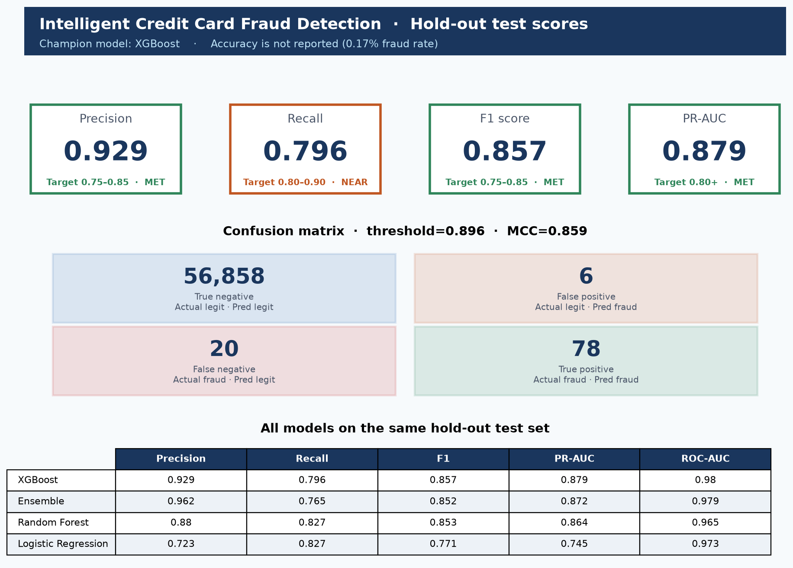
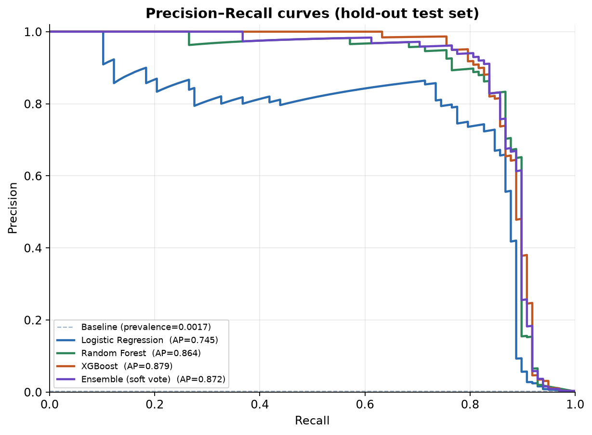
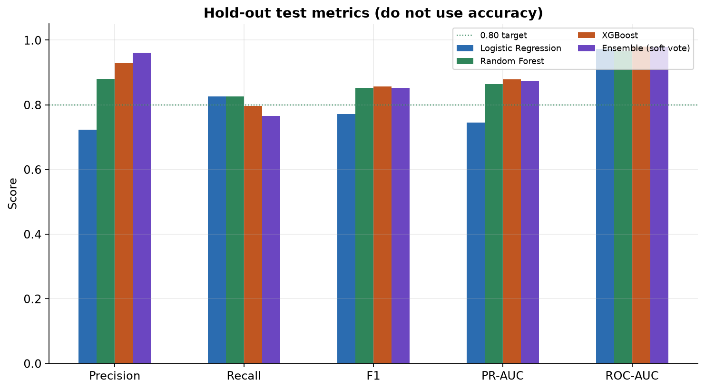
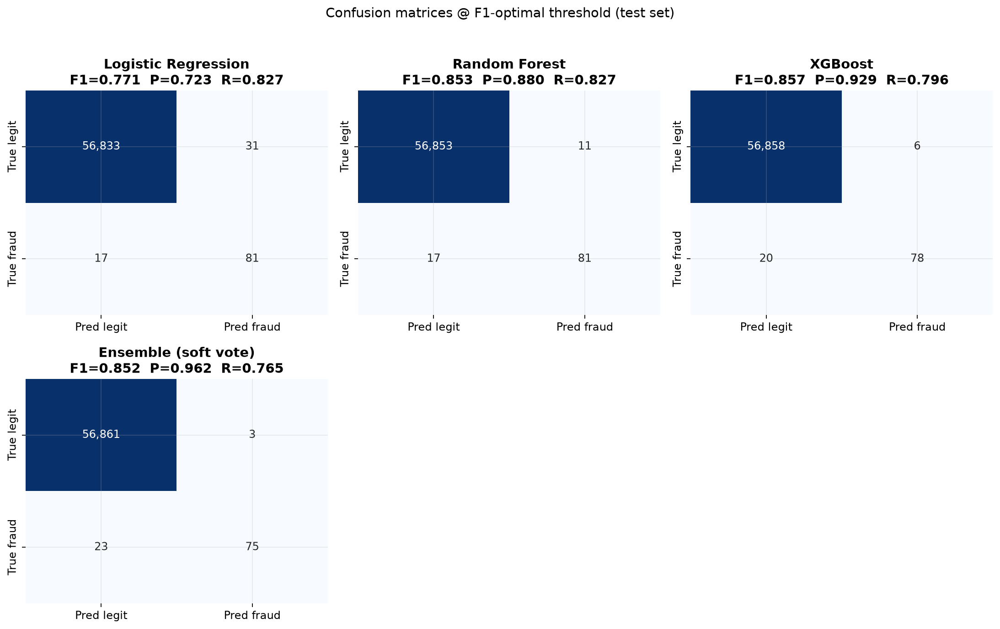
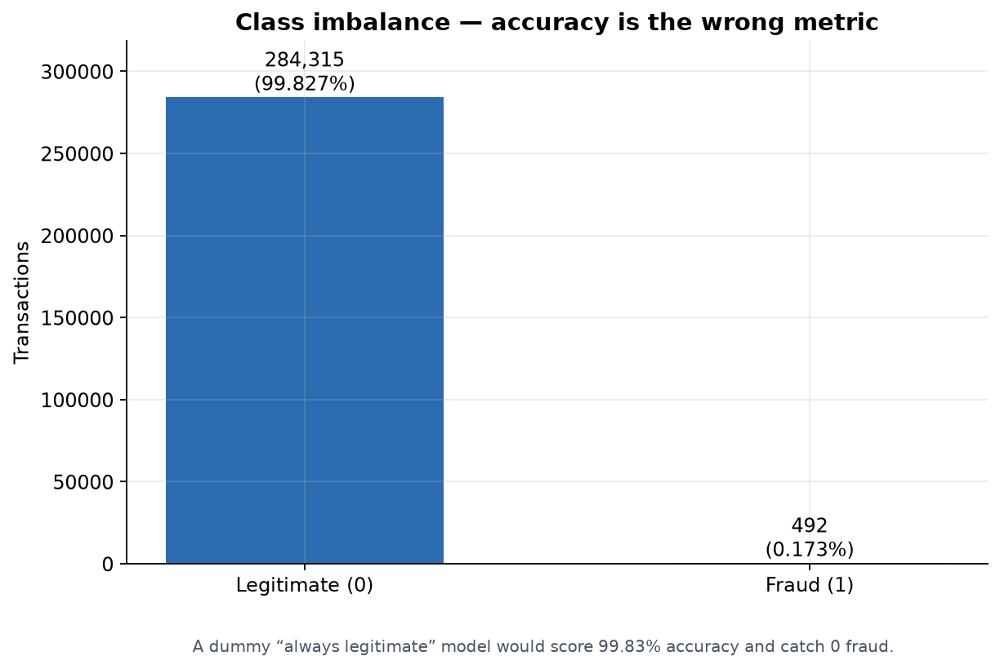
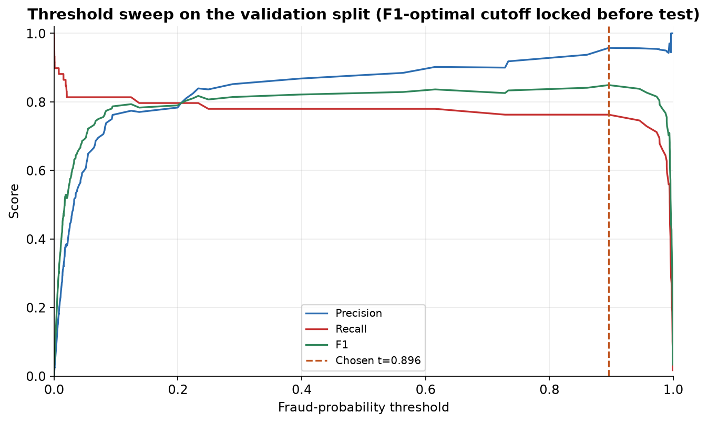
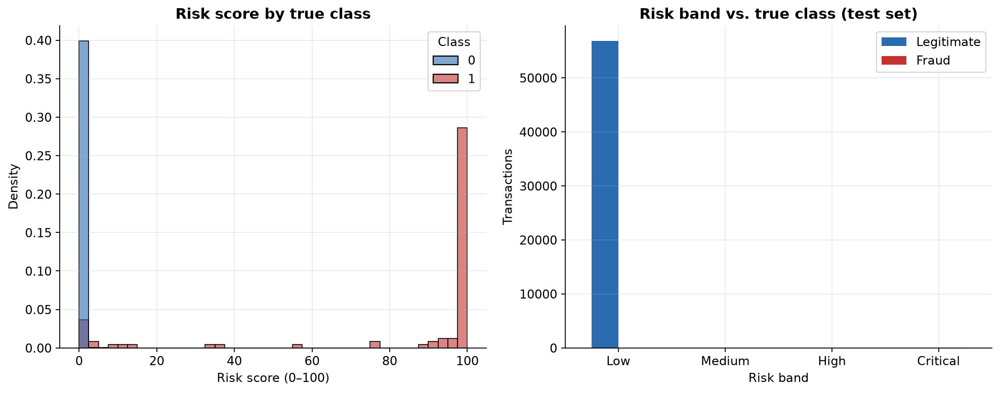
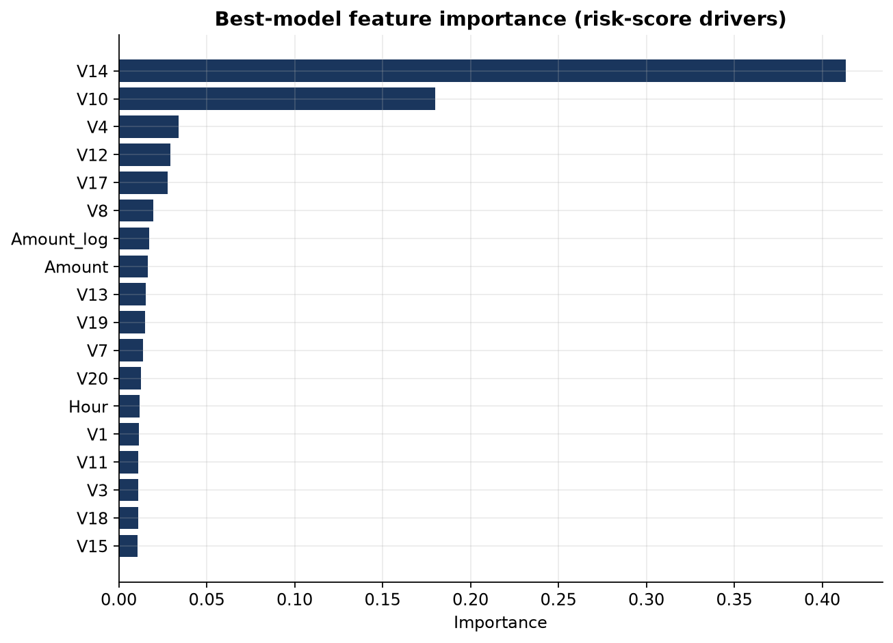

# Intelligent Credit Card Fraud Detection and Risk Scoring

Python pipeline that scores **284,807** public ULB credit-card transactions, finds fraud under a **1:578** class imbalance, and turns `P(fraud)` into a **0–100 risk score** with Low / Medium / High / Critical actions.

Accuracy is never used as a success metric. A dummy model that always predicts “legitimate” would score **99.83% accuracy and catch zero fraud**.



## Hold-out test results (20% stratified, never used for training or threshold tuning)

Champion: **XGBoost** with an F1-optimal threshold of **0.896** chosen on the validation split, then frozen.

| Metric | Score | Target | Status |
|---|---|---|---|
| Precision | **0.929** | 0.75–0.85 | MET (only 6 false blocks on 56,864 legit payments) |
| Recall | **0.796** | 0.80–0.90 | NEAR (78 / 98 frauds; 20 missed) |
| F1 | **0.857** | 0.75–0.85 | MET |
| PR-AUC | **0.879** | 0.80+ | MET (primary ranking metric) |
| ROC-AUC | 0.980 | secondary | — |
| MCC | 0.859 | — | — |
| Specificity | 0.9999 | — | — |

If you need recall ≥ 80% with precision still high, **Random Forest** on the same split scores precision **0.880**, recall **0.827**, F1 **0.853**, PR-AUC **0.864** (threshold 0.388).







## Dataset

The file `creditcard-selected-columns.csv` in this repo is an **empty placeholder** (header `Time,V1,…,V9` only — no `Amount`, no `Class`, no rows). `train.py` detects that and downloads the public ULB CSV to `data/creditcard.csv` (~144 MB, gitignored).

| | |
|---|---|
| Source | [ULB / Kaggle credit-card fraud](https://www.kaggle.com/datasets/mlg-ulb/creditcardfraud) (TensorFlow public mirror) |
| Rows | 284,807 |
| Fraud | 492 (0.173%) |
| Features | `Time`, PCA `V1`–`V28`, `Amount`, label `Class` |
| Missing values | 0 |



## Quick start

```bash
python -m pip install -r requirements.txt
python train.py
python -m pytest
python predict.py --csv examples/sample_transactions.csv
```

```bash
python train.py --data data/creditcard.csv   # local CSV
python train.py --fast --skip-cv             # smoke run
python train.py --demo --fast                # synthetic data, no download
```

Scoring API after training:

```bash
uvicorn api:app --host 0.0.0.0 --port 8000
# GET  /health
# GET  /model
# POST /predict   {"transactions": [{...ULB columns...}]}
```

## What the pipeline does

1. Load the ULB table (or auto-download it).
2. **Stratified 70 / 10 / 20** train / validation / test split (fraud rate preserved).
3. Train-only feature engineering: `Amount_log`, `Amount_zscore`, `Amount_to_mean`, `Hour`, `Hour_sin`, `Hour_cos`, `Is_night`.
4. `StandardScaler` fitted on train only.
5. **SMOTE on train only** (fraud lifted to 10% of the majority) for logistic regression.
6. Class-weighted **Random Forest**; **XGBoost** with `scale_pos_weight = sqrt(n_legit / n_fraud)` and a fixed tree budget (the validation fold has only ~59 frauds, so PR-AUC early stopping is too noisy).
7. Soft-vote ensemble of XGBoost + Random Forest.
8. F1-optimal **threshold on validation**, then a single shot at the hold-out test set.
9. Risk scores `P(fraud) × 100` plus a composite that also uses amount unusualness and night-time flags.
10. Stratified 5-fold CV on an 80k training subsample (default 0.5 cutoff — not the F1-optimal threshold).

SMOTE is never applied to validation or test.



## All models (same hold-out test set)

| Model | Threshold | Precision | Recall | F1 | PR-AUC | ROC-AUC | TP | FP | FN | TN |
|---|---|---|---|---|---|---|---|---|---|---|
| **XGBoost (champion)** | 0.896 | **0.929** | 0.796 | **0.857** | **0.879** | 0.980 | 78 | 6 | 20 | 56,858 |
| Ensemble (XGB+RF) | 0.754 | 0.962 | 0.765 | 0.852 | 0.872 | 0.979 | 75 | 3 | 23 | 56,861 |
| Random Forest | 0.388 | 0.880 | **0.827** | 0.853 | 0.864 | 0.965 | 81 | 11 | 17 | 56,853 |
| Logistic Regression | 0.965 | 0.723 | 0.827 | 0.771 | 0.745 | 0.973 | 81 | 31 | 17 | 56,833 |

5-fold CV PR-AUC on the training subsample: XGBoost **0.848 ± 0.067**, Random Forest **0.821 ± 0.054**, logistic regression **0.749 ± 0.062**.

## Risk scoring

| Score | Band | Action |
|---|---|---|
| 0–30 | Low | Approve immediately |
| 30–60 | Medium | Manual review recommended |
| 60–80 | High | Block and notify the customer |
| 80–100 | Critical | Block and escalate to the fraud team |

```
simple_score    = P(fraud) × 100
composite_score = 100 × (0.70 × P(fraud) + 0.20 × amount_deviation + 0.10 × is_night)
```

There is no merchant/location field in this dataset, so the 0.10 location weight from the original spec is folded into the model probability.



Top risk-score drivers (XGBoost gain): **V14**, **V10**, **V4**, **V12**, **V17** — the usual PCA components for this public dataset — plus `Amount_log` and `Hour`.



## Project layout

```
train.py                         # python train.py
predict.py                       # batch / JSON scoring CLI
api.py                           # FastAPI scoring service
src/fraud_detection/
  pipeline.py                    # orchestrates the steps above
  data.py                        # load / download / synthetic demo
  features.py                    # leak-free feature engineering
  models.py                      # LR, RF, XGBoost, ensemble, SMOTE
  evaluate.py                    # metrics, threshold search, stratified CV
  risk.py                        # 0–100 scores and bands
  plots.py                       # README figures
  persist.py                     # joblib bundle + markdown/json reports
tests/                           # unit tests (no 144 MB download required)
data/creditcard.csv              # auto-downloaded, gitignored
artifacts/figures/               # score screenshots
artifacts/reports/metrics.json
artifacts/models/champion_bundle.joblib
examples/sample_transactions.csv
```

## Design choices (vs. common mistakes)

| Mistake | What this repo does instead |
|---|---|
| Report 99%+ accuracy | Precision / recall / F1 / **PR-AUC** |
| SMOTE the whole CSV then split | Split first; SMOTE **train only** |
| Random split | `stratify=y` on every split and on CV |
| Tune the threshold on the test set | Tune on validation, freeze, then test |
| Early-stop boosting on the test set | Fixed tree budget; val fold is too small for stable PR-AUC stopping |
| Default 0.5 cutoff | F1-optimal validation threshold |
| 1:1 SMOTE (~450k rows) | Mild SMOTE (10% ratio) + class weights on trees |
| Scale with full-data statistics | Scaler and amount z-scores fit on train |

## Retrain / monitor

Track monthly precision, recall, F1, and PR-AUC in production. Retrain when any of them drops more than ~5% or when feature distributions drift. The saved bundle is `artifacts/models/champion_bundle.joblib` (feature engineer + scaler + model + threshold).
